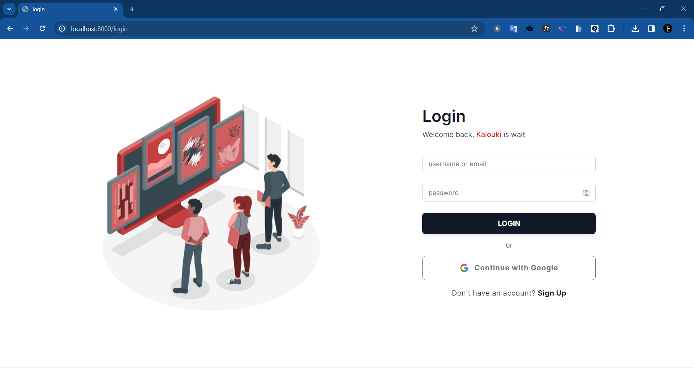

<p align="center"></p>

# Kalouki - Personal Image Gallery Project

Welcome to Kalouki, my personal image gallery project! Kalouki is a user-friendly application that allows users to showcase and organize images with ease. Built with a focus on simplicity and modern design, Kalouki is ideal for anyone looking to display their favorite photos in a beautiful, organized way.

## Features

-   **Responsive Design**: The gallery adapts to any screen size, providing a seamless experience on desktop, tablet, and mobile devices.
-   **Like Images**: Engage with images by liking your favorites.
-   **Commenting**: Share your thoughts by leaving comments on images.
-   **Google Login**: Easy and secure login using Google authentication.

## Installation

To run Kalouki locally on your machine, follow these steps:

1. Clone the repository:

    ```
    git clone https://github.com/Fanloop/image-galery.git
    ```

2. Navigate into the project directory:

    ```
    cd image-galery
    ```

3. Install the backend dependencies (Laravel):

    ```
    composer install
    ```

4. Install the frontend dependencies:

    ```
    npm install
    ```

5. Set up the environment variables for Laravel:

    - Copy `.env.example` to `.env` and configure the database settings.
    - Generate an application key:
        ```
        php artisan key:generate
        ```

6. Set up the database:

    ```
    php artisan migrate
    ```

7. Compile frontend assets (Livewire and Tailwind CSS):

    ```
    npm run dev
    ```

8. Start the Laravel server:
    ```
    php artisan serve
    ```

## Technologies Used

-   **Frontend**: Livewire and Tailwind CSS for a modern and responsive user interface.
-   **Backend**: Laravel for robust server-side functionality.
-   **Database**: MySQL or other databases supported by Laravel for efficient data storage and management.
-   **Authentication**: Integrated with Google OAuth for secure and convenient login.

## How to Use

1. Access the application in your browser:

    ```
    http://localhost:8000
    ```

    for both frontend and backend.

2. Log in using your Google account:

    - Ensure you have set up Google OAuth 2.0 credentials through the [Google Cloud Console](https://console.cloud.google.com/).
    - Create a new project and enable the "Google+ API" or "Google Identity" service.
    - Set up OAuth consent screen and add the necessary scopes for email and profile.
    - Obtain your Client ID and Client Secret, then configure them in your `.env` file for Laravel:
        ```
        GOOGLE_CLIENT_ID=your-client-id
        GOOGLE_CLIENT_SECRET=your-client-secret
        GOOGLE_REDIRECT_URI=http://localhost:8000/callback/google
        ```

3. After logging in, start uploading images to create your personalized gallery.
4. Like and comment on images to interact with your collection.

> **Note:** Ensure that the Google API credentials are kept secure and not exposed publicly. Always use environment variables to manage sensitive information.

## Screenshots


_Login page of Kalouki where users can sign in using Google._


_Overview of the home page showcasing the image gallery._


_Profile page where users can view and manage their profile details and uploaded images._


_Search page allowing users to search and filter images within the gallery._

## About This Project

Kalouki was developed as a personal project to enhance my skills in full-stack web development. It showcases my ability to build interactive, responsive, and user-centered applications. This project reflects my passion for creating visually appealing and functional web solutions.

## License

This project is for personal use and learning purposes.

## Contact

If you have any questions or feedback, feel free to reach out to me at [fahriprayoga3010@gmail.com](mailto:fahriprayoga3010@gmail.com).

---

Thank you for taking the time to explore Kalouki! I hope you enjoy this project as much as I enjoyed building it.
